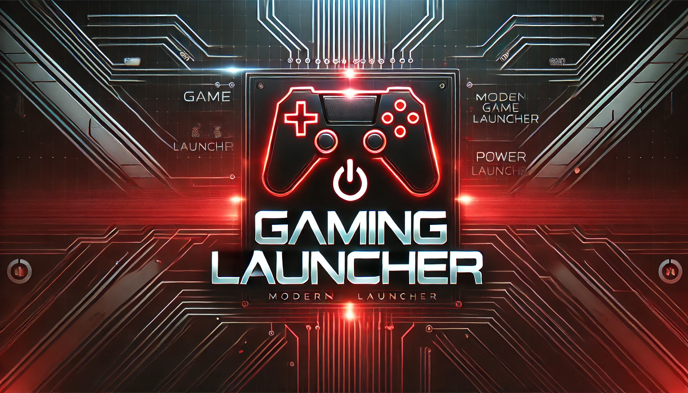
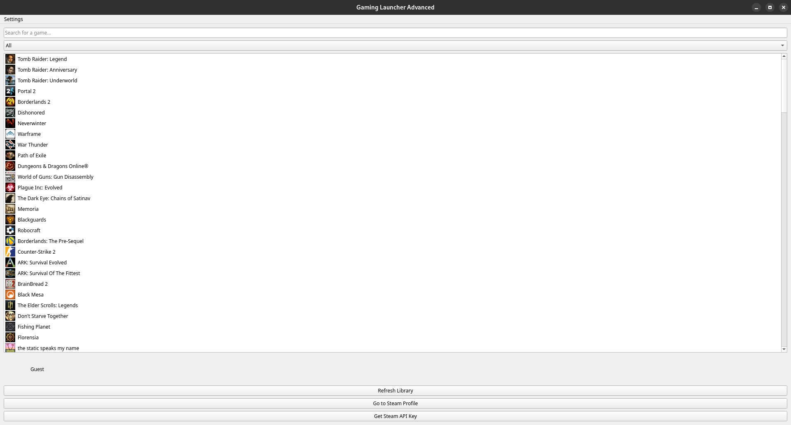
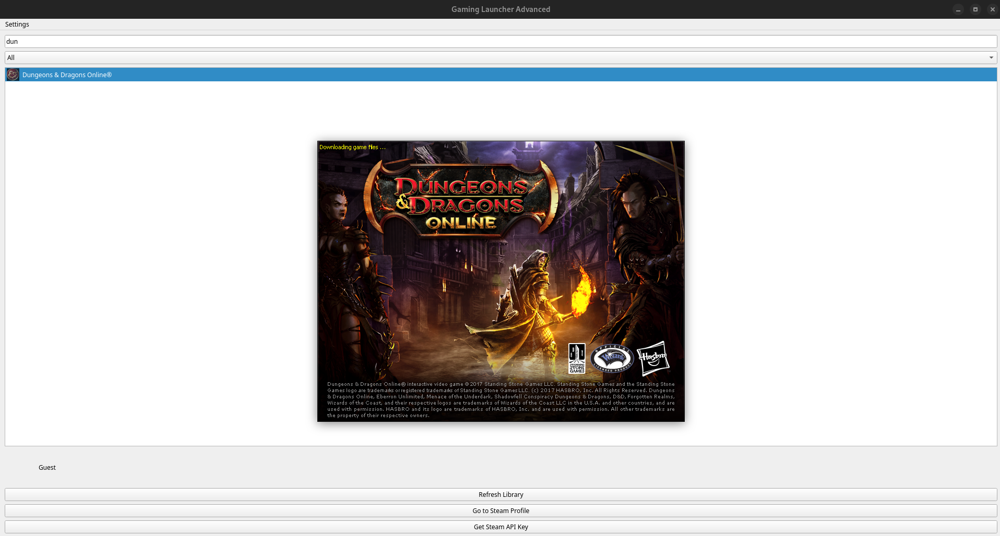

# 🎮 GamingLauncher 🚀  

Welcome to **GamingLauncher** – a cross-platform game launcher designed for simplicity and efficiency!  
Easily manage and launch your favorite games on **Linux** and **Windows** with a sleek, user-friendly interface.

> ⚠ **Early Development Notice**  
> This is an early version of GamingLauncher and is still under development. Some features may not work as expected, and there might be bugs.  
> Since I am working on this project alone, progress may be slow, and I have limited time to dedicate to it.  
> Your understanding and feedback are greatly appreciated! 💙  

---

## 📌 Table of Contents  
- [✨ Features](#-features)  
- [📥 Installation](#-installation)  
- [🕹 Usage](#-usage)  
- [🤝 Contributing](#-contributing)  
- [📜 License](#-license)  

---

## ✨ Features  
✔ 🎮 **Cross-Platform** – Works on **Linux** & **Windows**  
✔ 🔗 **Steam Integration** – Add & launch games from Steam without manually opening the Steam client  
✔ 🎨 **Customizable** – Modify launcher settings easily  
✔ ⚡ **Automated Builds** – GitHub Actions generate executables for both platforms  

---

## 📥 Installation  
Download the latest release from the [📦 Releases Section](https://github.com/TabbyOS/GamingLauncher/releases) and follow the instructions below:  

### 🐧 Linux Installation  
1. **Download** the Linux executable.  
2. **Make it executable**:  
   ```bash
   cd /path/to/executable/
   chmod +x GamingLauncher
   ```  
3. **Run the launcher**:  
   ```bash
   ./GamingLauncher
   ```  

### 🖥 Windows Installation  
1. **Download** the Windows `.exe` file.  
2. **Run the launcher** by double-clicking the `.exe` file – it's that easy!  

---

## 🕹 Usage  
Once GamingLauncher is running, you can:  
🎯 **Add your favorite games** and launch them directly.  
⚙ **Customize settings** to fine-tune your gaming experience.  
📋 **Enjoy a simple and intuitive interface** for managing your games.  

  

---

## 🤝 Contributing  
Want to improve GamingLauncher? Contributions are welcome! 💡  

### Steps to contribute:  
1. **Fork the repository**.  
2. **Clone your forked repository**:  
   ```bash
   git clone https://github.com/yourusername/GamingLauncher.git
   ```  
3. **Make changes and commit with a clear message**.  
4. **Push your changes**:  
   ```bash
   git push origin your-branch
   ```  
5. **Submit a pull request** to the main repository.  

  

---

## 📜 License  
This project is licensed under the MIT License – see the [LICENSE](./LICENSE) file for details.  

---

## 🚀 Stay Updated!  
⭐ **Star** this repository to get notified about updates!  
💬 **Feedback?** Feel free to open an **Issue**!  

Happy gaming! 🎮🔥  
